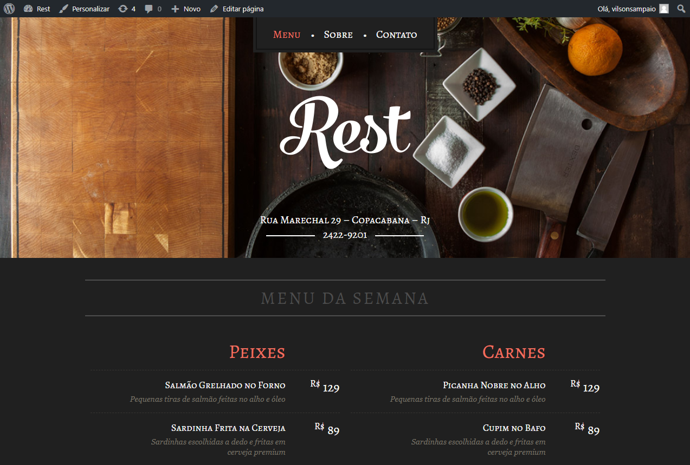
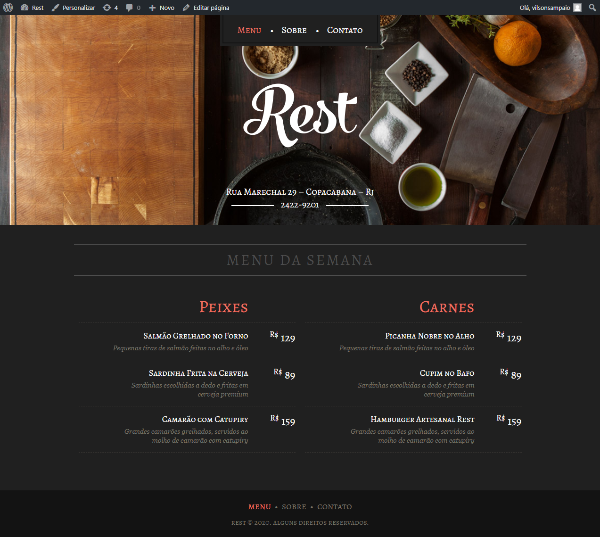
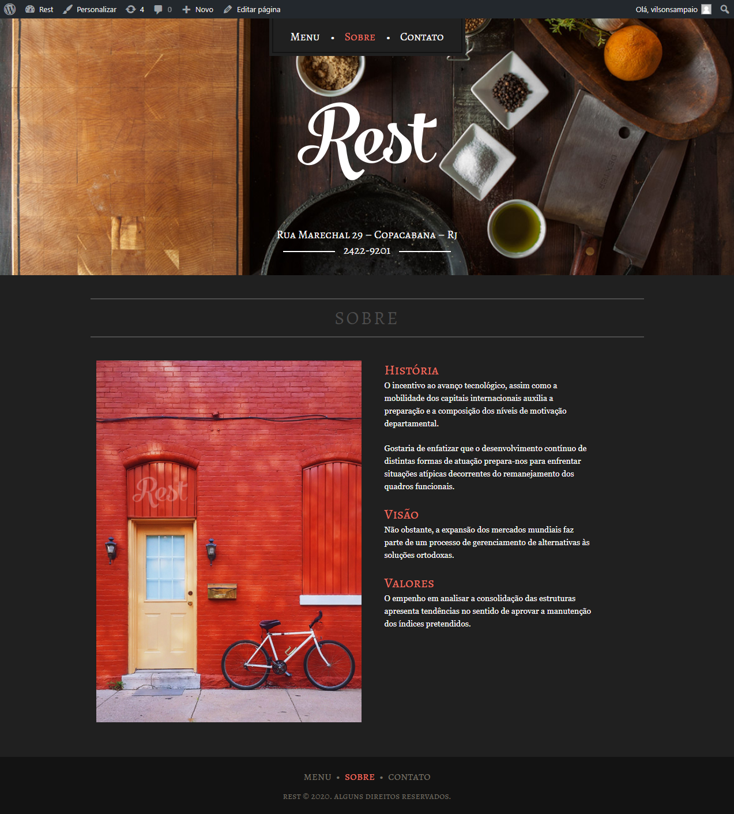
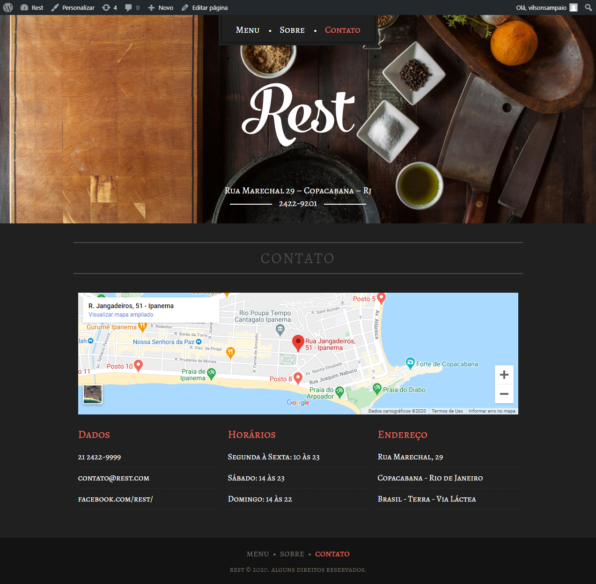

<h1 align="center">
    
</h1>

  
   
  

  

  

  <a href="#-sobre-o-projeto">Sobre o projeto</a>&nbsp;&nbsp;&nbsp;|&nbsp;&nbsp;&nbsp;
  <a href="#-tecnologias">Tecnologias</a>&nbsp;&nbsp;&nbsp;|&nbsp;&nbsp;&nbsp;
  <a href="#-layout">Layout</a>&nbsp;&nbsp;&nbsp;|&nbsp;&nbsp;&nbsp;
  <a href="#-projeto-final">Projeto final</a>

 

  

## 💻 Sobre o projeto

O Rest é um restaurante fictício especializado em carnes e frutos do mar, cujo objetivo é de se posicionar melhor no mercado e mostrar os pratos disponíveis na semana, capturando mais clientes e assim, consequentemente, aumentar seu faturamento através de um website.

Com adição de um CMS (Content Manager System - Sistema de Gerenciamento de Conteúdo), que nesse caso é o WordPress, agora o cliente pode alterar vários textos, links, páginas e posts do site, sem precisar entrar em contato com o código.

## 🚀 Tecnologias

Esse projeto foi desenvolvido com as seguintes tecnologias:

- [WordPress](https://codex.wordpress.org/pt-br:P%C3%A1gina_Inicial)
- [PHP](https://www.php.net/manual/pt_BR/index.php)
- [HTML5](https://developer.mozilla.org/pt-BR/docs/Web/HTML)
- [CSS3](https://developer.mozilla.org/pt-BR/docs/Web/CSS)

## 🔖 Layout

O layout do site foi desenvolvido durante o curso de **WordPress Como CMS** da [Origamid](https://www.origamid.com/curso/wordpress-como-cms).

## 🌐 Projeto final

### Home

### Sobre

### Contato

---

<h4 align="center">
  Feito com ❤️ <a href="https://www.linkedin.com/in/vilsonsampaio/" target="_blank">Vilson Sampaio</a>
</h4>